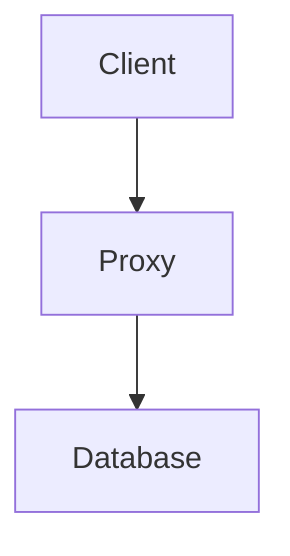

# FOOD-Me


_**F**inally a <ins>G**OO**D</ins> **D**atabase **M**iddlewar**e**_

Nom nom nom :P

A simple generic database middleware, that supports OIDC as an authentication method and allows for deep access control.

## Introduction

**Disclaimer**: I can "proudly" say that no LLM has been used to generate this piece of README text. Enjoy reading this raw text of my twisted mind. Or don't, you can also skip it I suppose :(

OIDC/OAuth2 is becoming the industry standard for handling authentication as well as authorization. However, when it comes to database communications, most databases lack OIDC as the authorization mechanism, and for a good reason! OIDC was meant to be the authentication mechanism for WebApps, websites that allow you to log in with your favorite social media provider instead of creating a new username and password that you'll definitely forget unless put into the password manager. And, the authentication flow performs website redirects, which don't really work well with direct TCP database connections.

But, the world of cloud computing is moving forward, and instead of having a beefy laptop/PC, people and nerds (developers) started using cloud computing and desktops in their browsers instead of their own devices. And, most of these cloud desktop platforms actually use OIDC to log you in, meaning you have potentially access to your bearer token very natively.

Also if you don't, direct access grants do exist in the OIDC world, so you can get your tokens directly as well. But that's a bit boring...

Anyway, long story short, this project is offering you a way to use the bearer tokens to authenticate with your favorite database, without actually changing the database itself or installing any plugins into the database etc. Instead, we have a proxy that lives just in front of the database, handles the bearer tokens gracefully and forwards your TCP packets to the database and back if authenticated successfully.

Pretty neat and yummy. Right?

## Features

- OIDC authentication and authorization
- User impersonation in the session
- Handles TLS connections and supports custom certificates
- Most common drivers and databases (wishful thinking, needs work ¯\\\_(ツ)\_/¯)
- OPA integration (wishful thinking, needs work ¯\\\_(ツ)\_/¯)

## How does it work?

The basic flow is (from the client's perspective):

1. Retrieve access and refresh tokens from your OIDC provider
2. Make a connection request to your database via FOOD-Me proxy with the access and refresh tokens
3. The proxy verifies the tokens, if everything is A-OK, the proxy will authenticate to the database as the configured\* user
4. Afterward, any packets received from the client are linked to the bearer tokens. If a new packet arrives from the client, the proxy will check the validity of the access token. If it is invalid, the proxy will try to refresh it using the refresh token. If it fails, the packet is then denied and the connection gets terminated, otherwise the packets are proxied to the database and the response back to the client.

\*The configured user is the username+password combination given to the proxy as a configuration value. This should be a superuser capable of doing all the possible damage in the database that's possible.

But hold on, that sounds extremely insecure! So basically I can only use the FOOD-Me middleware to perform an OIDC method to authenticate as a superuser in the database? What good is that for?

Well, it is good for some things, like increasing the attack vectors, enabling more security vulnerabilities, perhaps also allowing the Soviets to rule again, but yeah otherwise it sucks. Especially if all your users exist in the database with their complicated permissions schemes. Don't worry though, the proxy offers you a way out as well!

You can decide for yourself what the proxy should do upon successful authentication. There are essentially 3 options:

1. Continue the connection as the superuser (yeaaah)
2. Based on the UserInfo data, pick up the username from the OIDC claims and assume the user for the connection session (boooo)
3. Continue as the superuser, but use OPA for handling access and modifying the input queries (hmmmmm)

That's right, FOOD-Me does more than you'd initially think!

### How do I send access and refresh tokens to the proxy?

There are 2 methods to do this:

1. Directly in the DSN as a user specification. Instead of the `user` and `password` fields, you can just omit the `password` field and specify the `user` as `user=access_token=${my_access_token};refresh_token=${my_refresh_token}`. The proxy will automatically parse this and use it to fetch the OIDC identity.
2. Use the proxy RestAPI endpoint. The main problem with the direct DSN entry is that many common drivers (such as ODBC) restrict the length of the username to 255 characters. That's not enough to send long JWT tokens. The proxy thus offers you to set these via a RestAPI endpoint `POST :${API_PORT}/connection`, which expects you to send the access and refresh tokens, and in return will give you a unique `username` to be used in the DSN connection. A simple Python example (assuming `localhost` for simplicity)

   ```python
   username = requests.post("http://localhost:10000/connection", json={"access_token": "ACCESS", "refresh_token": "REFRESH"}).json()["username"]
   dsn = f"host=localhost port=2099 user={username} database=test"
   ```

The most basic example can be found at https://github.com/ryshoooo/food-me/tree/main/examples/postgres-keycloak.

### How do I configure the OIDC client?

Simple really. This is just a configuration option in the proxy when you start it up. See the [full list of all configuration options](#configuration-options).

However, there is an option to have multiple clients configured for a single database! Usually, a single database does not consist of a single database (sounds weird, but it's true). This is also why you specify the `database` field in your DSN, you are also specifying which database you want to connect to. Well, FOOD-Me allows you to define different OIDC clients for different databases. This way you can control who has access to which database in your OIDC provider instead!

You can find a detailed example at https://github.com/ryshoooo/food-me/tree/main/examples/postgres-keycloak-multiclients.

### How do I assume a user session?

As mentioned above, it is also possible to assume a user (role) session with the OIDC connection. For this flow to work, all you need is to set 3 values upon starting the proxy:

- `OIDC_ASSUME_USER_SESSION` needs to be `true`, by default it is false and this flow is then skipped
- `OIDC_ASSUME_USER_SESSION_USERNAME_CLAIM` specifies which claim key to expect and take from the userinfo JSON structure and use it as the value for user/role to impersonate. By default, the key is set to `preferred_username` as it is the OIDC standard for the username field, but you can change it to anything you want, especially useful for custom claims in the UserInfo structure. In all honesty, it's not the best name for the configuration, as most of the time people use roles rather than users in a database, so you probably want to use this as a role assumption rather than a user assumption. Which you can absolutely do, even though it is called "username claim". But meh...
- `OIDC_ASSUME_USER_SESSION_ALLOW_ESCAPE` is another boolean value, which determines whether escaping from the user/role session is allowed. Usually, you want this value to be `false`, but you have the prison break option here if you want to have some fun.

With these values set, the proxy will try to retrieve the field from the UserInfo structure and attempt to perform a user/role impersonation. Thus if the connection is successful, the connection will look and feel as an authenticated user/role direct database connection.

You can find a detailed example at https://github.com/ryshoooo/food-me/tree/main/examples/postgres-keycloak-assume-role.

### How do I not get bothered with user database administration?

The assume user session is great if the user/role already exists in the database. If it does not, it just fails to execute. Maybe that's fine, failures exist for a reason. But, the flow has a requirement of managing users and roles in the database as a separate step. Would be nice not to handle that manually.

That's where the middleware offers you a post-auth script execution. In this case, you can specify `OIDC_POST_AUTH_SQL_TEMPLATE` to point to a file, which contains a [golang template](https://pkg.go.dev/text/template) of a SQL script, which is automatically executed after successful user authentication and before the assume user session directive. The template is parsed with the UserInfo context fetched from the OIDC UserInfo endpoint containing the specific authenticated user's data, thus you can parametrize the statements based on the attributes of the user from the OIDC provider.

You can see a detailed example of how to use the post-auth SQL script to control whether a user is a superuser in the Postgres database via group memberships at https://github.com/ryshoooo/food-me/tree/main/examples/postgres-keycloak-postauth.

### How can I handle SSL/TLS connections?

Let's remember the common structure in place when using the proxy:



Obvious but important, as there are 2 ways to handle TLS connections:

1. The proxy connection to the database is encrypted and the client connection to the proxy is not
2. Both connections (i.e. client->proxy and proxy->database) are encrypted

If the database uses a TLS connection, the proxy can and will handle it just fine. However, if the proxy is not configured with a server certificate and key, the connection to the client will be unencrypted. This is generally frowned-upon, but without a certificate, what else can you do ¯\\\_(ツ)\_/¯.

There is no requirement for the proxy certificate to be identical to the database certificate. Actually, it's very likely a bad idea as most certificate verifications would likely fail. Thus a separate certificate for the proxy which matches the true hosting server and DNS the proxy lives under is the way to go.

With double TLS, there is an overhead of double-TLS termination. What that means that the proxy has to first decrypt the client data with the server key, encrypt them with the database certificate and send them to the upstream database. And vice-versa when receiving database responses, decrypt them using the database's certificate, encrypt them using the server's private key and send them to the client. So there's a latency price to pay when using the proxy in the super-TLS mode, but that's the price for safety I guess.

You can also use the server certificate and key to encrypt the API connections. So really go TLS all the way.

You can find a detailed example of a single TLS connection at https://github.com/ryshoooo/food-me/tree/main/examples/postgres-keycloak-tls and a double TLS connection at https://github.com/ryshoooo/food-me/tree/main/examples/postgres-keycloak-double-tls.

# Technical specification

Jokes aside, let's get into some nitty-gritty boring nerd stuff.

## Supported database

- [x] Postgres
- [ ] Microsoft SQL Server
- [ ] MySQL/MariaDB
- [ ] OracleDB

## Configuration options

| Name                                      | Description                                                                                               | CLI                                       | Environment variable                    | Options & types                         |
| ----------------------------------------- | --------------------------------------------------------------------------------------------------------- | ----------------------------------------- | --------------------------------------- | --------------------------------------- |
| Log Level                                 | Logging level                                                                                             | --log-level                               | LOG_LEVEL                               | trace,debug,info,warn,error,fatal,panic |
| Log Format                                | Log formatting                                                                                            | --log-format                              | LOG_FORMAT                              | text,json,pretty                        |
| Destination Host                          | The database destination hostname                                                                         | --destination-host                        | DESTINATION_HOST                        | string                                  |
| Destination Port                          | The database destination port number                                                                      | --destination-port                        | DESTINATION_PORT                        | number                                  |
| Destination Type                          | The database type                                                                                         | --destination-database-type               | DESTINATION_TYPE                        | postgres                                |
| Destination Username                      | The superuser username                                                                                    | --destination-username                    | DESTINATION_USERNAME                    | string                                  |
| Destination Password                      | The superuser password                                                                                    | --destination-password                    | DESTINATION_PASSWORD                    | string                                  |
| Destination Log Upstream                  | Flag whether to perform a debug log of all packets coming from the destination database                   | --destination-log-upstream                | DESTINATION_LOG_UPSTREAM                | boolean                                 |
| Destination Log Downstream                | Flag whether to perform a debug log of all packets coming from the client                                 | --destination-log-downstream              | DESTINATION_LOG_DOWNSTREAM              | boolean                                 |
| OIDC Enabled                              | Flag specifying whether OIDC verification is enabled                                                      | --oidc-enabled                            | OIDC_ENABLED                            | boolean                                 |
| OIDC Client ID                            | The global OIDC client ID                                                                                 | --oidc-client-id                          | OIDC_CLIENT_ID                          | string                                  |
| OIDC Client Secret                        | The global OIDC client secret                                                                             | --oidc-client-secret                      | OIDC_CLIENT_SECRET                      | string                                  |
| OIDC Token URL                            | URL for the token endpoint                                                                                | --oidc-token-url                          | OIDC_TOKEN_URL                          | URL                                     |
| OIDC UserInfo URL                         | URL for the userinfo endpoint                                                                             | --oidc-user-info-url                      | OIDC_USER_INFO_URL                      | URL                                     |
| OIDC Database Client ID Mapping           | A mapping between the database names and Client IDs                                                       | --oidc-database-client-id                 | OIDC_DATABASE_CLIENT_ID                 | key1=value1,key2=value2                 |
| OIDC Database Client Secret Mapping       | A mapping between the database names and Client secrets                                                   | --oidc-database-client-secret             | OIDC_DATABASE_CLIENT_SECRET             | key1=value1,key2=value2                 |
| OIDC Database Fallback to the Base Client | Flag whether to fallback on the global client ID in case there is no match in the database client mapping | --oidc-database-fallback-to-base-client   | OIDC_DATABASE_FALLBACK_TO_BASE_CLIENT   | boolean                                 |
| OIDC Assume User Session                  | Flag whether automatic role assumption should be applied upon successful authentication                   | --oidc-assume-user-session                | OIDC_ASSUME_USER_SESSION                | boolean                                 |
| OIDC Assume User Session - Username Claim | The claim key name in the UserInfo data which holds the role name for the user session                    | --oidc-assume-user-session-username-claim | OIDC_ASSUME_USER_SESSION_USERNAME_CLAIM | string                                  |
| OIDC Assume User Session - Allow escape   | Flag which determines whether an escape from user session is allowed during the session                   | --oidc-assume-user-session-allow-escape   | OIDC_ASSUME_USER_SESSION_ALLOW_ESCAPE   | boolean                                 |
| OIDC Post-Auth SQL Template               | Path to a template file with SQL statement to execute after a successful OIDC authentication              | --oidc-post-auth-sql-template             | OIDC_POST_AUTH_SQL_TEMPLATE             | string                                  |
| Server TLS Enabled                        | Indicates whther TLS is enabled in the proxy                                                              | --server-tls-enabled                      | SERVER_TLS_ENABLED                      | boolean                                 |
| Server TLS Certificate File               | Path to the server certificate for TLS connections                                                        | --server-tls-certificate-file             | SERVER_TLS_CERTIFICATE_FILE             | string                                  |
| Server TLS Certificate Key File           | Path to the server certificate key file for TLS connections                                               | --server-tls-certificate-key-file         | SERVER_TLS_CERTIFICATE_KEY_FILE         | string                                  |
| Port                                      | Port where the proxy is started (default 2099)                                                            | --port                                    | PORT                                    | number                                  |
| API Port                                  | Port where the proxy will serve the RestAPI                                                               | --api-port                                | API_PORT                                | number                                  |
| API TLS Enabled                           | Indicates whether the API should be served with the server certificate                                    | --api-tls-enabled                         | API_TLS_ENABLED                         | boolean                                 |
| API Username Lifetime                     | Lifetime of the username created by the API in seconds                                                    | --api-username-lifetime                   | API_USERNAME_LIFETIME                   | number                                  |
| API GC Period                             | The period in seconds when the garbage collection should run                                              | --api-garbage-collection-period           | API_GARBAGE_COLLECTION_PERIOD           | number                                  |

TODO:

- Also, code this shit up
